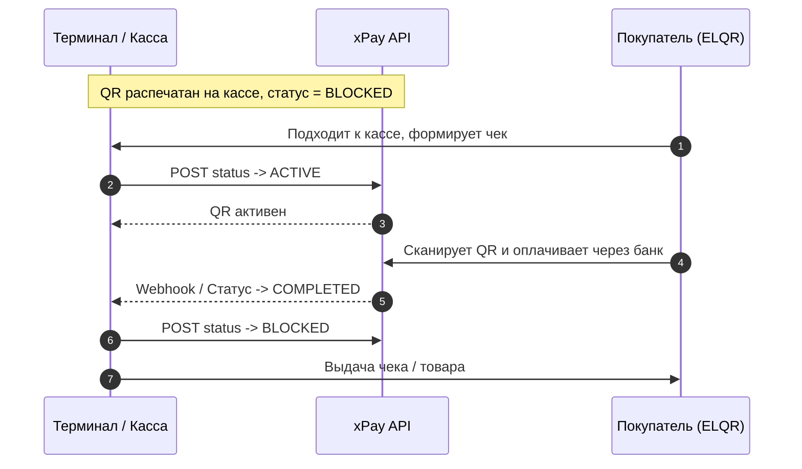

# xPay API v1.5 — Документация для разработчиков

Документация по интеграции платежной системы **xPay** (прием платежей через QR-коды национальной системы **ELQR**, банковские приложения и терминалы XPAY в Кыргызстане).

---

## 📌 Содержание
- [Обзор](#обзор)
- [Окружение и базовые URL](#окружение-и-базовые-url)
- [Аутентификация](#1-аутентификация)
  - [POST /api/v1/developer/login](#post-apiv1developerlogin)
- [Работа с динамическими QR-кодами](#2-работа-с-динамическими-qr-кодами)
  - [Генерация QR-кода (POST /api/v1/developer/qr/get)](#post-apiv1developerqrget)
  - [Проверка статуса оплаты (GET /api/v1/developer/qr/dynamic/status/{qr_transaction_id})](#get-apiv1developerqrdynamicstatusqr_transaction_id)
  - [Справочник статусов платежа](#справочник-статусов-платежа)
- [История транзакций](#3-история-транзакций)
  - [GET /api/v1/developer/transactions](#get-apiv1developertransactions)
- [Работа со статическими QR-кодами](#4-работа-со-статическими-qr-кодами)
  - [Проверка статуса статического QR (GET /api/v1/developer/qr/ecom/static/status/{qr_transaction_id})](#get-apiv1developerqrecomstaticstatusqr_transaction_id)
  - [Изменение статуса / Блокировка (POST /api/v1/developer/qr/ecom/static/status/{qr_transaction_id})](#post-apiv1developerqrecomstaticstatusqr_transaction_id)
  - [Сценарий использования статического QR](#сценарий-использования-статического-qr)
- [Особенности оплаты и UI/UX рекомендации](#5-особенности-оплаты-и-uiux-рекомендации)

---

## Обзор

**xPay API** предоставляет инструменты для интеграции платежей с использованием QR-кодов:
- **Генерация QR-кодов**: динамических (под конкретную транзакцию) и статических (многоразовых).
- **Проверка статусов**: через REST API (polling) и webhook-уведомления (`callback_url`).
- **Авторизация**: на основе Bearer JWT-токенов.
- **Интеграция с ELQR**: плательщик может оплатить через любое банковское приложение или кошелек Кыргызстана (MBank, Optima24, Bakai, DemirBank, Balance, O!Dengi, Kompanion и др.).
- **Поддержка физических QR-терминалов XPAY** (вывод QR на экран терминала).

---

## Окружение и базовые URL

| Среда | Базовый URL API | Назначение |
| :--- | :--- | :--- |
| **Тестовая (Sandbox)** | `https://devapi.xpay.kg` | Разработка, тестирование эмуляции оплат |
| **Боевая (Production)** | `https://api.xpay.kg` | Реальные платежи через ELQR |

### Дополнительные сервисы
- **Личный кабинет**: [https://lk.xpay.kg](https://lk.xpay.kg) — получение боевых ключей (`client_id`, `client_secret`) в разделе «Профиль».
- **Песочница тестирования оплаты**: [https://sandbox.xpay.kg](https://sandbox.xpay.kg) — оплата и смена статусов тестовых QR-кодов.
- **Страница оплаты для клиентов**: `https://pay.xpay.kg` (или `https://devpay.xpay.kg` для теста) — веб-интерфейс оплаты со ссылками на банковские приложения.

---

## 1. Аутентификация

### `POST /api/v1/developer/login`
Получение временного Bearer токена доступа.

> ⚠️ **Важно:** Токен действителен в течение **30 минут**. Рекомендуется обновлять токен перед сессией запросов или кэшировать его с проверкой времени жизни (`expires_at`).

#### Тестовые учетные данные (Sandbox)
```json
{
  "client_id": "fNXw8p5lf5MBBRWl2caUDcgV8mihD2nUpEXfsHBDZtjrDHr6OZbztfb6umGT4pf9lWgjvQkf4e1PW1rybf1FPiEr6yUzT9Aem3VD",
  "client_secret": "tWUaGGC7kwow42mfVYV13Cn8gPTA9lKt1Pa7gjAPGOgrRThyxA4h29TYOW4zMxpoqNc5bUw7NpU67Pw2UFjNstada6SfDEfK1Aaj"
}
```

#### Заголовки запроса
```http
Content-Type: application/json
Accept: application/json
```

#### Тело запроса (Request Body)
```json
{
  "client_id": "<YOUR_CLIENT_ID>",
  "client_secret": "<YOUR_CLIENT_SECRET>"
}
```

#### Ответ при успехе (`200 OK`)
```json
{
  "status": "Success",
  "message": "Developer LogIn",
  "data": {
    "access_token": "210957|AobljetLaY2QRbPE0WUpRcmTtNLrwMxiXVi3uwgm626285kk",
    "token_type": "Bearer",
    "expires_at": "2026-02-09T10:52:55.000000Z",
    "service": [
      {
        "uuid": "485b0981-8e71-41bf-97fd-4e8769e8cd9f",
        "mode": "SANDBOX",
        "name": "SANDBOX Прием оплаты по QR коду",
        "tsp_name": "ТестоваяТорговаяТочка",
        "tsp_qr_name": "TestCompany",
        "tsp_address": "г. Бишкек, ул. Тестововича д. 50",
        "tsp_activities": "Розничная торговля авиабилетами",
        "tsp_type": 1,
        "tsp_serial": "ECOMTEST",
        "currency_code": "KGS",
        "transaction_limits": {
          "min": "0.00000000",
          "max": "-1.00000000",
          "daily": "-1.00000000",
          "monthly": "-1.00000000"
        },
        "service_charge": [
          {
            "start_date": "2024-03-31",
            "end_date": "2075-03-31",
            "min_amount": "0.00000000",
            "max_amount": "-1.00000000",
            "transaction_top_fixed_charge": "0.00000000",
            "transaction_top_percent_charge": "0.00000000",
            "transaction_low_fixed_charge": "0.00000000",
            "transaction_low_percent_charge": "0.00000000"
          }
        ]
      }
    ]
  }
}
```

#### Параметры ответа
- `access_token` — Bearer-токен для передачи в заголовке `Authorization: Bearer <access_token>`.
- `expires_at` — Дата и время истечения токена (UTC).
- `service[].uuid` — **UUID услуги (торговой точки)**, обязателен для генерации QR-кодов.
- `service[].mode` — Режим работы (`SANDBOX` или `PRODUCTION`).
- `service[].tsp_serial` — Серийный номер физического терминала XPAY или виртуальной точки.

#### Ответ при ошибке
```json
{
  "status": "Error",
  "message": "Invalid credentials",
  "data": null
}
```

---

## 2. Работа с динамическими QR-кодами

Динамический QR-код формируется под конкретный заказ/пользователя на фиксированную сумму.

### `POST /api/v1/developer/qr/get`
Создание нового QR-кода на оплату.

#### Заголовки запроса
```http
Authorization: Bearer <YOUR_ACCESS_TOKEN>
Content-Type: application/json
Accept: application/json
```

#### Тело запроса (Request Body)
```json
{
  "uuid": "485b0981-8e71-41bf-97fd-4e8769e8cd9f",
  "amount": 10000,
  "type": "dynamic",
  "payer_id": "user_12345",
  "service_id": "order_9988",
  "service_name": "Оплата подписки",
  "comments": "Оплата заказа #9988",
  "callback_url": "https://yourdomain.kg/api/payment/webhook",
  "return_url": "https://yourdomain.kg/payment/success",
  "check_url": "https://yourdomain.kg/api/payment/check",
  "amount_change": false,
  "qr_pos": false
}
```

#### Описание параметров запроса

| Параметр | Тип | Обязательный | Описание |
| :--- | :--- | :---: | :--- |
| `uuid` | `string (uuid)` | **Да** | Идентификатор услуги `service[].uuid` из ответа авторизации. |
| `amount` | `integer` | **Да** | **Сумма в тыйынах!** Например, `10000` тыйын = **100.00 KGS**. |
| `type` | `string` | Нет | `"dynamic"` (по умолчанию) или `"static"`. |
| `payer_id` | `string` | Нет | Идентификатор плательщика в вашей системе. |
| `service_id` | `string` | Нет | Код заказа/услуги в вашей системе. |
| `service_name` | `string` | Нет | Человекочитаемое название услуги. |
| `comments` | `string` | Нет | Комментарий к платежу, отображается в банковском приложении. |
| `callback_url` | `string` | Нет | URL для получения Webhook уведомления о смене статуса оплаты. |
| `return_url` | `string` | Нет | URL для перенаправления пользователя после успешной оплаты. |
| `check_url` | `string` | Нет | URL предавторизации. xPay делает запрос к этому URL и ждет `HTTP 201 Created` перед тем, как разрешить проведение платежа. |
| `amount_change`| `boolean` | Нет | Разрешить плательщику менять сумму (`false` для dynamic). |
| `qr_pos` | `boolean` | Нет | Отправить QR на физический POS-терминал XPAY (`true`/`false`). |

#### Ответ при успехе (`200 OK`)
```json
{
  "status": "Success",
  "message": "Generate QR Code",
  "data": {
    "qr_transaction_id": "1770634567jZXWF3UsNotJyGu",
    "identificator": "17435071778cycy252qj7u29y",
    "qr_code": "https://devpay.xpay.kg#00020101021232610007sandbox01011100620100011251770634567jZXWF3UsNotJyGu...",
    "qr_image": "https://devimage.xpay.kg/00020101021232610007sandbox...png",
    "type": "dynamic",
    "payer_id": "201000",
    "service_id": "1",
    "service_name": "Оплата за услугу",
    "comments": "Оплата услуги 201000",
    "callback_url": "https://webhook.site/4f08ee99-d0fe-4fc5-9d66-9d85830f7120",
    "return_url": "https://xpay.kg",
    "check_url": "https://xpay.kg/check",
    "serial": "ECOMTEST",
    "qr_pos": false,
    "amount_change": false,
    "request_amount": 1000000,
    "amount": 1000000,
    "payable": 1000000
  }
}
```

#### Ключевые поля ответа
- `qr_transaction_id` — **Уникальный ID транзакции**, используется для проверки статуса оплаты.
- `qr_code` — Ссылка на страницу оплаты (`pay.xpay.kg`). Пользователь со смартфона может кликнуть на нее и перейти напрямую в банковское приложение без необходимости сканировать код вторым устройством.
- `qr_image` — Прямой URL на сгенерированное PNG-изображение QR-кода.
- `request_amount` — Сумма к оплате с учетом комиссий.
- `amount` — Сумма выставленного счёта.
- `payable` — Итоговая сумма к зачислению на ваш расчетный счет.

---

### `GET /api/v1/developer/qr/dynamic/status/{qr_transaction_id}`
Проверка текущего статуса оплаты динамического QR-кода.

#### Заголовки запроса
```http
Authorization: Bearer <YOUR_ACCESS_TOKEN>
Accept: application/json
```

#### Ответ при успехе (`200 OK`)
```json
{
  "status": "Success",
  "message": "Status QR Code",
  "data": {
    "qr_transaction_id": "1734439544EjZ25uVX16UDKxX",
    "pay_status": "COMPLETED",
    "transaction_uuid": "9dc11610-0651-40ee-8459-cabe889fec3x",
    "trx": "467de507-5a4d-4a26-bb95-9bdf7258f300",
    "request_amount": "240.00000000",
    "amount": "235.00000000",
    "payable": "233.12000000",
    "created_at": "2024-11-05T05:20:51.000000Z",
    "executed_time": "2024-12-18 18:50:44"
  }
}
```

---

### Справочник статусов платежа

| Статус (`pay_status`) | Тип | Описание |
| :--- | :--- | :--- |
| `WAITING` | Промежуточный | Счёт выставлен, ожидается сканирование/оплата клиентом. |
| `ACTIVE` | Промежуточный | QR-код открыт/активен. |
| `PROCESSING` | Промежуточный | Платеж находится в процессе межбанковской обработки. |
| **`COMPLETED`** | **Конечный** | **Платеж успешно выполнен и зачислен.** |
| **`ERROR`** | **Конечный** | Ошибка при проведении платежа. |
| **`CANCELED`** | **Конечный** | Платеж отменен клиентом или истекло время ожидания. |

---

## 3. История транзакций

### `GET /api/v1/developer/transactions`
Получение журнала транзакций с фильтрацией и пагинацией.

#### Заголовки запроса
```http
Authorization: Bearer <YOUR_ACCESS_TOKEN>
Accept: application/json
```

#### Query-параметры

| Параметр | Тип | Обязательный | Валидация / Значения | Описание |
| :--- | :--- | :---: | :--- | :--- |
| `service_uuid` | `uuid` | Нет | `nullable\|uuid` | UUID услуги/точки из авторизации. |
| `per_page` | `integer` | Нет | `nullable\|integer\|min:1` | Количество записей на страницу (пагинация). |
| `direction` | `string` | Нет | `in:in,out` | Направление транзакции (`in` — входящие, `out` — исходящие). |
| `transaction_id`| `uuid` | Нет | `nullable\|uuid` | UUID конкретной транзакции. |
| `status` | `integer` | Нет | `1, 2, 3, 4` | **1**: Success/COMPLETED<br>**2**: Pending<br>**3**: Hold<br>**4**: Rejected |
| `date_start` | `string` | Нет | ISO 8601 UTC | Начальная дата фильтра (`2026-05-10T17:49:04.000000Z`). |
| `date_end` | `string` | Нет | ISO 8601 UTC | Конечная дата фильтра (`2026-05-11T20:55:00.000000Z`). |

---

## 4. Работа со статическими QR-кодами

Статические QR-коды печатаются на физических носителях (наклейки, стенды, терминалы самообслуживания). Для разделения потока покупателей используется механизм блокировки.

### `GET /api/v1/developer/qr/ecom/static/status/{qr_transaction_id}`
Проверка статуса статического QR-кода.

#### Ответ
```json
{
  "status": "Success",
  "message": "Status Static Ecom QR Code",
  "data": {
    "qr_transaction_id": "1744611438OoJCAVsfAGOFdMN",
    "qr_status": "ACTIVE",
    "request_amount": 100,
    "amount": 100,
    "payable": 99.2,
    "last_update": "2025-04-14 12:17:18"
  }
}
```

---

### `POST /api/v1/developer/qr/ecom/static/status/{qr_transaction_id}`
Изменение статуса и блокировка/разблокировка оплаты по статическому QR-коду.

#### Тело запроса
```json
{
  "qr_transaction_id": "1743509023fY8dWExXHG5Wf9f",
  "qr_status": "BLOCKED"
}
```
*Допустимые значения `qr_status`: `"ACTIVE"` или `"BLOCKED"`.*

#### Ответ
```json
{
  "status": "Success",
  "message": "Status Static Ecom QR Code",
  "data": {
    "qr_transaction_id": "1744611438OoJCAVsfAGOFdMN",
    "qr_status": "BLOCKED",
    "request_amount": 100,
    "amount": 100,
    "payable": 99.2,
    "last_update": "2025-04-14 12:32:31"
  }
}
```

### Сценарий использования статического QR



---

## 5. Особенности оплаты и UI/UX рекомендации

1. **Мобильные пользователи (Deep Linking):**
   При открытии ссылки `qr_code` (`pay.xpay.kg/...`) на смартфоне клиент видит кнопки быстрого перехода в приложения банков Кыргызстана (MBank, Optima24, Bakai, O!Dengi и др.). Не обязательно показывать изображение QR-кода на мобильных экранах — достаточно дать кнопку/ссылку на `pay.xpay.kg`.

2. **Формат суммы:**
   В запросе `/api/v1/developer/qr/get` поле `amount` передается **в тыйынах** (`100 сом = 10000`). В ответах на проверку статуса суммы могут возвращаться строковыми или числовыми десятичными значениями в сомах (например, `"235.00000000"` или `100`).

3. **Webhook (`callback_url`):**
   Рекомендуется настраивать вебхук для асинхронного подтверждения оплаты вместо агрессивного поллинга, а поллинг статуса производить с интервалом не менее 2–3 секунд.

4. **Тестирование (Sandbox):**
   Тестовые платежи оплачиваются через специальный эмулятор [https://sandbox.xpay.kg](https://sandbox.xpay.kg).
